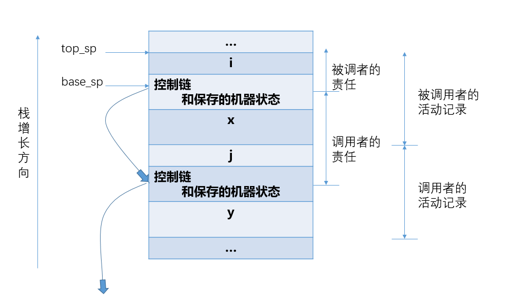
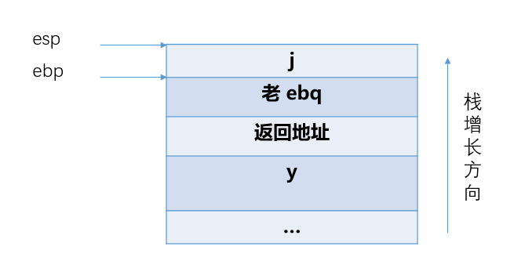

# H8
PB18111697 王章瀚

## 1. 
教材6.6  下面是 C 语言两个函数 f 和 g 的概略(他们不再有其他的局部变量):
```c
int f(int x) {int i; ...return i + 1; ...}
int g(int y) {int j; ... f(j+1); ...}
```
请按照图6.11 的形式, 画出函数g调用f, f的函数体正在执行时, 活动记录栈的内容及相关信息, 并按图6.10左侧箭头方式画出控制链. 假定函数返回值是通过寄存器传递的. 

下图是相关信息, 由于使用寄存器返回, 故没有返回值这一个栈空间



## 2.
教材6.18 下面是一个C语言程序:
```c
#include <stdio.h>
int main() {
    long i;
    long a[0][4];
    long j;
    i = 4; j = 8;
    printf("%ld, %d\n", sizeof(a), a[0][0]);
}
```
虽然出现long a[0][4]这样的声明, 但在x86/Linux系统上, 用编译器GCC 7.5.0 (Ubuntu 7.5.0-3ubuntu1~16.04)编译时, 该程序能够通过编译并生成目标代码. 请在你自己的机器上实验, 回答下面两个问题(说明你使用的编译器及版本并给出汇编码)：
(a) sizeof(a)的值是多少, 请说明理由. 
(b) a[0][0]的值是多少, 请说明理由. 

(a). sizeof(a)的值是0, 因为数组a的大小为 0 * 4 = 0
(b). a[0][0]的值是一个不定值. 这是因为实际上虽然 a 大小为0, 但还是有它的栈空间(-16(%rbp)), 因此输出了这个值.(下面是汇编代码节选)

```s
movq    $4, -32(%rbp)   ; i = 4
movq    $8, -24(%rbp)   ; j = 8
movq    -16(%rbp), %rax ; 这一步访问了 a[0][0]
```

## 3.

```c
int main() {
    int i,j;
    while ( (i || j) && (j > 5) ) {
        i = j;
    }
}
```
```s
    .file   "ex7-9.c"
    .text
    .globl  main
    .type   main, @function
main:
.LFB0:
    pushq   %rbp                ; 保存 %rbp
    movq    %rsp, %rbp          ; 设置 %rsp
    jmp     .L2                 ; 跳到 .L2
.L5:
    movl    -4(%rbp), %eax      ; 
    movl    %eax, -8(%rbp)      ; 两句即 i = j
.L2:
    cmpl    $0, -8(%rbp)        ; 比较 i 和 0
    jne     .L3                 ; 不等则 (i || j) 为真, 开始验证 (j > 5)
    cmpl    $0, -4(%rbp)        ; 否则看 j 和 0
    je      .L4                 ; 如果相等, 则循环条件不满足, 跳到 .L4, 否则继续验证是否满足 (j > 5)
.L3:
    cmpl    $5, -4(%rbp)        ; 比较 j 和 5
    jg      .L5                 ; 若 j > 5 则跳转到 .L5
.L4:
    movl    $0, %eax            ; 返回值
    popq    %rbp                ; 弹出 %rbp
    ret                         ; 返回
.LFE0:
    .size   main, .-main
    .ident  "GCC: (Ubuntu 7.5.0-3ubuntu1~16.04) 7.5.0"
```

因此比较顺序就是, 
1. 首先判断 i 是否为 0, 如果是就直接验证 j > 5; 如果不是就继续判断 j 是否为 0
2. 如果 j 也为 0, 那么整个条件为假, 跳出循环; 如果 j 不为 0, 就可以去验证 (j > 5)
3. 验证完 j > 5 整个条件也就判断完了

所以确实是用短路计算方式来完成布尔表达式计算的


## 4.
1). 被修改的原因是, 可能字符串常量 "12345\0" 和 "abcdefghij\0" 连续存放, 也就是
|cp1||||||cp2|||||||||||
|:-|:-|:-|:-|:-|:-|:-|:-|:-|:-|:-|:-|:-|:-|:-|:-|:-|:-|:-|
|1|2|3|4|5|\0|a|b|c|d|e|f|g|h|i|j|\0|
这样复制过去的时候就直接覆盖变成了
|cp1||||||cp2|||||||||||
|:-|:-|:-|:-|:-|:-|:-|:-|:-|:-|:-|:-|:-|:-|:-|:-|:-|:-|:-|
|a|b|c|d|e|f|g|h|i|j|\0|f|g|h|i|j|\0|
所以输出 cp1 就是 "abcdefghij", 而输出 cp2 就是 "ghij"

2). 段错误是因为原本常量 "12345" 空间就那么大, strcpy 的时候, 源字符串长度比它长, 就会导致越界, 因此报了段错误

## 5.

```c
#include <stdio.h>
void funcOld(i,j,f,e)
short i, j; float f, e;
{
    short i1,j1; float f1,e1;
    printf("%p, %p, %p, %p\n", &i,&j,&f,&e);
    printf("%p, %p, %p, %p\n", &i1,&j1,&f1,&e1);
}
void func(short i, short j, float f, float e)
{
    short i1,j1; float f1,e1;
    printf("%p, %p, %p, %p\n", &i,&j,&f,&e);
    printf("%p, %p, %p, %p\n", &i1,&j1,&f1,&e1);
}
int main()
{
    short i,j; float f,e;
    func(i,j,f,e);
    funcOld(i,j,f,e);
}
```
输出结果为
```
0x7fffbec47f1c, 0x7fffbec47f18, 0x7fffbec47f14, 0x7fffbec47f10
0x7fffbec47f2c, 0x7fffbec47f2e, 0x7fffbec47f30, 0x7fffbec47f34
0x7fffbec47f1c, 0x7fffbec47f18, 0x7fffbec47f10, 0x7fffbec47f08
0x7fffbec47f2c, 0x7fffbec47f2e, 0x7fffbec47f30, 0x7fffbec47f34
```

### 内存布局
#### 老式
|地址|值|
|:-|:-|
|0x7fffbec47f08|e|
|0x7fffbec47f10|f|
|0x7fffbec47f18|j|
|0x7fffbec47f1c|i|
|...||
|0x7fffbec47f2c|i1|
|0x7fffbec47f2e|j1|
|0x7fffbec47f30|f1|
|0x7fffbec47f34|e1|

#### 新式
|地址|值|
|:-|:-|
|0x7fffbec47f10|e|
|0x7fffbec47f14|f|
|0x7fffbec47f18|j|
|0x7fffbec47f1c|i|
|...||
|0x7fffbec47f2c|i1|
|0x7fffbec47f2e|j1|
|0x7fffbec47f30|f1|
|0x7fffbec47f34|e1|

### 产生这种结果的原因
- 首先, 经测试, 在 `clang` 编译出的程序无此奇怪的结果, 因此应该是 `gcc` 的锅
- 传参方式有点不同, `funcOld` 多了个:
    ```asm
    cvtss2sd        -4(%rbp), %xmm1
    ```
- 接收参数的时候, 两个函数也有一些不同:
    ```asm
    funcOld:
        cvtsd2ss        %xmm0, %xmm0
        movss   %xmm0, -48(%rbp)

    func:
         movss   %xmm0, -44(%rbp)
    ```

综上可知, funcOld 传递参数的时候先把 `float` 的数转化成了 `double`, 而接收的时候又转换回来.
