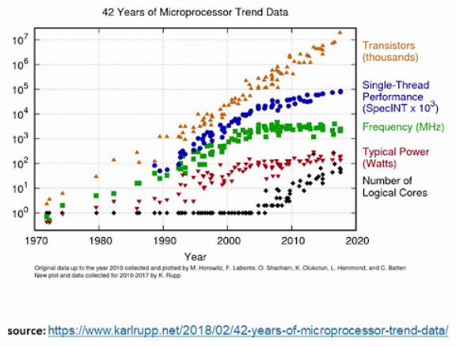

# AIoT时代的编程语言、编译器与指令集架构 -- 笔记

## 写: 下这篇报告中所讨论的问题及涉及的编译知识要点；

### 涉及问题
整个报告涉及的问题可分点总结如下:

#### 功耗-性能的矛盾

随着摩尔定律时代趋近结束, 处理器的 `Logical Cores` 也日渐增多. 如此多的核心带来了很大的`性能提升`, 但同时也带来了不少`功耗问题`. 据统计, 世界上所有机器运行着的软件总的能量密度甚至超过了核反应堆. 而更贴近生活地说, 手机性能与手机电池寿命等的矛盾也非常明显. 这一切都彰显着功耗与性能的矛盾日渐突出.


#### 通用处理器走向专用处理器

曾建江老师指出:"通用计算的时代已经结束, 性能提升走缓, 一个非常重要的趋势是处理器变得越来越专用." 这一点对于在这个领域内学习工作的人来说是十分显然的. 就 `AI` 领域而言, `GPU`, `TPU` 的兴起足以说明这点, 而其他领域也有不少类似样例, 比如将 `CPU` 的一些功能卸载到 `FPGA` 亦或是 `智能网卡`(`Smart NIC`). 

不仅如此, 市面上很多通用处理器指令集早已停止发展, 如今只剩下如 `x86` 这几大指令集. 更何况它们之间也并不是说独立发展的, 它们正走在相互融合的道路上. 比如 `x86` 指令集, 虽然他是 `CISC`, 但从它的具体指令来说, 很多都借鉴了 `RISC` 的概念; 同样地, `power` 指令集也引入了 `指令组合` 概念, 从逻辑上来看就和超长指令字思路上相通.

#### 编译优化重点从单核转向多核, 又转向异构

早在 2000 年左右, 单核优化是编译技术的重点,  比如循环展开优化, 数据识别等.

由于处理器的性价比是一个很重要的指标, 当单核处理器性能达到一定程度时, 就不得不通过多核来提高性能. 随着多核处理器的发展, 编译器的优化也逐渐转向了多核.

2010 后, 性能提升走向了异构的优化. 异构多核的表现其实就是现在处理器的形态从 `CPU` 转向 `GPU` 以及现在的 `AI芯片`. 显然, 我们现在已经在一个异构计算的定制化时代, `FPGA` 等可定制化的硬件不断兴起.

#### 软件灾难 (`software disaster`)

`异构/超异构时代` 对软件开发效率和兼容性提出了前所未有的挑战——软件灾难. 怎么让不同软件在不同芯片并行起来变成了一个难点. 比如说, 天河2集成了不同CPU,GPU集群, 如何让他们协同起来就是个问题. 而且, 以后还可能集成各种各样的 `XPU`(X表示未知).

从开发者视角来看, 不同处理器有不同的开发技巧(优化技巧), 这就导致了一个编程于异构体系上的开发者需要同时掌握软件信息和硬件知识, 这无疑是十分困难的.

再者, 异构处理器核之间的兼容性也是个问题. 软件是否可以跑在不同的处理器上, 分为了 `二进制兼容` 和 `源代码兼容性`. 而当前来看, 连 `源代码兼容` 都已经是一个非常大的挑战了. 举例而言, `NVIDIA GPU` 的开发, 可以使用通用的 `OpenCL`. `OpenCL` 可以针对不同的GPU用同种编程语言开发, 但是其性能并不能够保证一致(最高). 这导致保证了代码兼容性, 但又不能保证代码性能, 因此软件移植代价非常高.

#### 软件开发体验与高效性

主要是由这样三大趋势:

- 声明式开发: 所见即所得(UI即代码, 代码即UI)的可视化编程, 比如word就是所见即所得的文本编辑.
- 协同式开发: 多人协作/端云协同编程. 大规模的开发经常是有上百个开发者, 如何让大规模团队同时做有效的事情.
- 智慧化开发：AI辅助编程/AI可视化编程. 现在有一些代码提示, 但他们是代码逻辑上的提示. 未来时代可以推断出对代码性能的评估, 智能化编程能够在编程过程就知道代码效果, 包括性能, 安全等. 

#### 编程语言和编译器关注的

编程语言设计:
1. 表达能力强：容易描述计算, 业务逻辑
2. 容易使用, 好学好写好读
3. 不易出错, 代码安全

编译器的考量:
1. 运行时间短
2. 占用资源少
3. 平台无关, 移植性高

#### 编译器应该知道指令能怎样提升软件性能
#### 如软件有特定功能诉求, 应当知道需要什么样的指令

### 有关编译的知识总结

#### 产业案例

##### MindSpore
2019年9月18日, 华为在 59.8s 内完成 `ResNet-50` 的模型训练, 并现场展示了基于mindspore实现10.02s识别20万天体. 

这其中的关键技术主要有:
- superkernel优化技术. 在二进制层面实现了算子 `kernel融合调度`, 提升了性能.
- 并行编译, cache优化: 使得库上 CCE 算子构建时间大幅减少
- 算子编译优化和代码生成技术: 数量级地提升了 `TBE` 算子性能.

##### 方舟编译器
通过方舟编译器解决用户体验问题. 
- Java 全静态化编译技术. 基于统一IR将Java直接编译为机器码, 通过高强度编译优化提升运行效率
- Java RC内存管理: 融合编程约束实现 `无GC`, `低GC`, 对标 `Apple`
- JNI自动拆墙优化: 降低 Java <->C/C++ 互操作的开销

###### 跨平台的编译平台
方舟编译器提供了一个跨平台的编译平台, 内部由运行环境引擎, 可以把方舟编译器编译出来的运行在不同机器上, 当前支持 c 和 Java.

其获得性能的原理是 `降低跨语言调用的开销`.

实际应用中会需要调用由C代码实现的程序的时候, 两者之间必须跨越语言上的鸿沟, 需要有一个转换的过程, 这就是`JNI墙`, 这个调用过程会耗用额外的计算开销.

MAPLE(方舟内部执行引擎)则把不同语言的都统一到一个中间表达, 由统一的表达进行统一的优化, 就不需要额外的开销, 静态生成的可执行文件.

###### Auto-Tuning技术: 
- 通过静态翻译获得软件最优性能的障碍
  - 编译器的优化策略有非常多参数, 经过非常多变换过程, 每一个变换都有一个特定的策略. 比如循环展开：程序有一个循环要执行多次, 每一次跳转对处理器来说都有额外开销, 不用跳转的方式完成循环, 而是复制为多份, 这样就不用跳转. 
  - 不同参数组合有不同的策略, 静态生成的话问题在于如何组合？固定且单一的策略难以适应不同软件的特征. 不同执行环境可能要不同的参数, 所以`单一编译出来的策略并不能让所有平台上都达到最优`. 而且`已发布程序无法进一步优化` 也是一个很大的问题.
- Auto-Tuning技术: 让编译策略更加优, 更加好地适配运行环境, 自动评估优化效果
  - Tuning-enabled 编译器
  - search driver
  - prfiler(static/dynamic)
- 流程:
  - 内部的一些编译策略和需要调整的参数完全暴露给外部的控制程序(driver). 
  - 第一步编译到可执行程序
  - 然后运行程序/仿真程序, 以做评估, 来告知自动调优过程达到了怎样的性能水准
  - profiler作用就是识别当前的执行是否是一个高效的执行. 经过统计了包括访存时延, 性能高效性等, 就把这些信息交给profiler评估
  - 接下去就是search driver的工作, 收集完信息后, 给出通过profiler评估后的结果来给出下一步的更优参数
  - 当完成搜索, 就达到了闭环, 然后不断迭代. 这本质上是NP完备的问题, 而用这种方法则能得到一个相对优的解.

#### 编译的基本过程

报告中介绍了编译基本过程如下:

这与我们所学基本一致.

#### 三种执行方式的区别

- 解释执行：直观地说就是, 说一句, 做一句
- 编译执行：完整编译为机器可执行的二进制编码, 这是一次性的, 静态的编译, 特点是快. 
- 字节码虚拟机：例如 Java, 把程序源代码编译成字节码, 原则上与处理器/微处理器不相关, 然后由虚拟机执行. 这里的虚拟机不是通常意义上在PC机里可以启动的虚拟PC机, 而是用来运行字节码的虚拟的字节码机器. 
  - 实时编译：JIT(just in time), 
  - 热点代码编译成机器指令


##### 优化案例：如何使用一个既定指定针对场景进行优化. 可以通过特定场景的问题来设计. 

如何使用一个128bit位宽的原子操作来优化?

数据库应用中, 有大量的数据在多核体系中. 为了并发地对数据库内部数据进行读写, 且保证数据一致性, 需要通过自旋锁来操作. 比如要对日志系统的日志进行读写, 某一个处理器核要对数据进行修改的时候, 必须抢到这个锁, 只有抢到这把锁的处理器才能对数据进行修改, 改完还要释放, 才能保证读写是不会受干扰的. 每次读写都要抢一次, 就会造成非常多的冲突. 原来在数据库场景所用数据是128位数据, 但锁是单个字节的, 不能对128位的操作. 现在有这个就可以只抢一次就完成对这个数据的操作. 简单说就是可以一次保护128位. 这样系统上的冲突几率, 至少对于一个的操作的, 就减少了. 仅仅这一个修改就可能对数据库性能提升10%.


### 思： 程序语言和编译器对现代业界的作用和影响

1. 编程语言针对领域的表达能力能快速促进一个领域的发展. 一个最为明显的例子就是 `Python` 之于 `AI` 领域. Python 丰富多样的库和数学运算操作 以及各种各样的动态数据类型就决定了它能够很好地表达 AI 领域的问题, 因此也促进了 `AI` 快速发展. 现在基本上每个即使不了解 `AI` 但熟悉 `Python` 的相关从业人员都能拿它写出一些简单的 `AI` 算法.
2. 编程语言考虑的重点也能给业界带来新的思路. 最好的例子莫过于 `Rust` 语言. 作为一种强调 `安全` 的语言, 它将所有有安全问题的可能都放在编译阶段来解决. 而又能以此保证其性能直逼 `c` 语言. 
3. 编译器对代码逻辑的识别有深刻影响. 例如 `Intel` 的 `icc` 编译器则对其芯片有很高性能的支持. `icc` 提供了非常多的编译参数和编译指导选项来帮助开发者去指导编译器编译出更高性能的代码, 此外其对于自身的 `AVX` 和 `SSE` 也有着很多支持. 
`Intel` 甚至不断推出各种编译优化的软件, 一个例子就是 `Intel Advisor`, 它能够针对代码测试结果来指导开发人员如何使代码能够被编译得更好.
4. 编译器对不同体系结构的支持也有很多深刻影响. 一个例子就是 `gcc` 编译器. 它对不同处理器的支持可以说是很充分了, 这里就不细说了.

### 问: 抛出至少2个现存编程语言及编译中的问题，以及至少1个对在研或未来编程语言与编译的问题

#### 对现存的

##### 问题1
`JNI`, `Cython`, `Jython` 等是如何实现不同语言之间的交互的?

##### 问题2
很多能够提高性能的地方编译器都未能识别出来, 比如对循环中不断使用了字符串的长度, 这个长度理应可以存下来, 不必每次循环都重新计算.(后面会给出具体代码). 


#### 对未来的

- `Rust` 语言原生对 `安全` 的支持虽然受到了广泛好评, 但其学习曲线和编程难度也饱受非议. 未来是否能够通过`智能化的编程模式`来辅助开发人员进行相关编程?
- 新型 `AI` 编程语言应当如何取舍其原生支持的东西?


### 做: 给出对你抛出的现存编程语言及编译问题的解答（包含编程与编译分析）、以及你对在研或未来编程语言及编译问题的思考。

#### 对现存的

##### 问题1
就 `JNI` 而言, 它实现了 Java 跨语言交互的功能. 这意味着我们可以使用 Java 调用 c/c++ 的库.
###### JNI 使用步骤
1. 在 `Java` 类中声明 Native 方法, 并编译成 `.class` 文件. 这里 `Native` 方法担任的是一个代理角色, 它负责与底层语言对接.
```java
package com.hank.jni;

public class HelloWorld {
    static {
        System.loadLibrary("Hello");
    }

    public native void DisplayHello();
    
    public static void main(String[] args) {
        new HelloWorld().DisplayHello();
    }
}
```
执行 `javac ./com/hank/jni/HelloWorld.java` 以编译  
2. 用 `javah` 程序, 将上步中的 class 文件生成头文件
用 `javah -jni com.hank.jni.HelloWorld` 生成头文件.
3. 用其他语言实现上述头文件中的函数, 生成动态库, 供 Java 使用。
实现对应函数并执行 `g++ jni_helloworld.cpp -shared -o libHello.so -I /opt/jdk1.8.0_261/include/` 编译出动态链接库  
然后运行 `java -Djava.library.path=. com.hank.jni.HelloWorld` 即可输出
```shell
From jni_helloworldImpl.cpp :Hello world !
```

从整个流程也就可以看出来它的主要原理了.

##### 问题2
###### 例一. 函数求值结果复用优化
```c
#include <stdio.h>
#include <string.h>
#include <stdlib.h>

#define N 300000

#ifndef OUT
int main() {
    char* str = (char*)malloc(sizeof(char)*N);
    for (int i = 0; i < N-1; i++) {
        str[i] = 'a';
    }
    str[N-1] = 0;
    int i = 0;
    while (1) {
        int len = strlen(str);
        if (i < len) i++;
        else break;
        printf("%d\n", i);
    }
}
#else
int main() {
    char* str = (char*)malloc(sizeof(char)*N);
    for (int i = 0; i < N-1; i++) {
        str[i] = 'a';
    }
    str[N-1] = 0;
    int i = 0;
    int len = strlen(str);
    while (1) {
        if (i < len) i++;
        else break;
        printf("%d\n", i);
    }
}
#endif
```
```shell
gcc strlentest.c -o strlentest && time ./strlentest
gcc strlentest.c -o strlentest -DOUT && time ./strlentest
```

运行命令即可计时, 可以明显看出来如果把求字符串长度放在外面就会有明显的性能提升.

###### 

 

#### 对未来的

- 问题1: `Rust` 语言原生对 `安全` 的支持虽然受到了广泛好评, 但其学习曲线和编程难度也饱受非议. 未来是否能够通过智能化的编程模式来辅助开发人员进行相关编程?
  > 随着 `AI` 不断发展, 各种编程语言和编译器都在为了它铺路. 当其发展到一定程度时, 必然会有人想方设法去尝试利用 `AI` 反哺编程语言和编译器. 换句话说, 科研人员可以尝试着手于用 `AI` 识别代码逻辑, 这里面可以让开发者在开发时给出一些 `hint`, 让相应的 `AI` 系统辅助识别开发者的程序逻辑, 从而辅助开发者进行开发.
- 问题2: 新型 `AI` 编程语言应当如何取舍其原生支持的东西?
  > 非常著名的 `AI` 工具库 `torch` 和 `TensorFlow` 都支持了图描述的模型. 因此这种描述如果能够在未来 `AI` 编程语言里实现则很可能能够在底层编译等过程进行大幅优化, 进而提高性能. 此外, `自动微分` 和 `稀疏矩阵` 等也是当前 AI算法 中非常重要的一部分, 如果能有底层的支持那也将对性能有很大影响. 
  > 另一方面, `新型 AI 编程语言` 应当有其对应的高性能异构支持的编译器, 使之能够适配各种异构的体系结构.
  > 再者, 这种编程语言最好能够支持解释执行和编译执行. 支持解释执行是为了用户调试方便, 基于编译执行则可以最大化提高性能.
  > 最近兴起的 `Julia` 语言则似乎有意在 `未来AI语言` 的方向上发展.

### 惑: 给出你关于编程语言与编译的困惑或不明白的问题。

- 构建统一的中间表示会不会造成优化问题? 例如方舟编译器让 c 和 Java 有一个公共的中间表示, 这种表示很有可能就丧失了语言本身的特点, 而那些特点又通常能作为编译器优化的方向或思路. 如果统一构建为中间表示可能会导致这些优化方向都不再有效. 那么这时应当如何选取编译优化方向呢?
- 在当前语言有了各种各样有用的库的情况下, 为什么要选择开发一种原生支持这些库的语言, 而不是在原有语言上对这些库的编译等性能进行优化呢?
